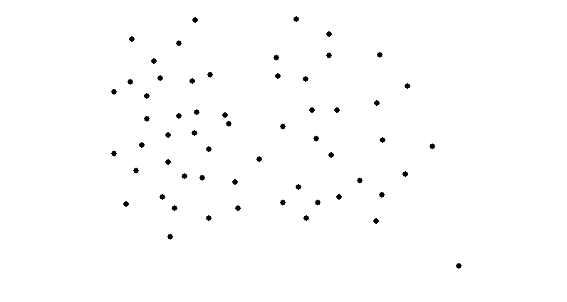

  

<h1 align="center">K-Means Clustering Simulator</h1>

	

<h4 align="center">Simulator for K Means Clustering Algorithm</h4>

<h2> How to use</h2>
<ol>
	<li>
		<h3>Plotting</h3>
	</li>

</ol>

For detailed explanation, you can visit my <a href="https://sushantpatrikar.github.io/flappybirdAI.html"> website</a>.

<h2>Future Scope</h2>

Right now, the algorithm used is NEAT. Some other Reinforcement Learning algorithm, such as Deep Q-Learning can be applied to it. If you have any other ideas, Pull Requests are welcomed!

