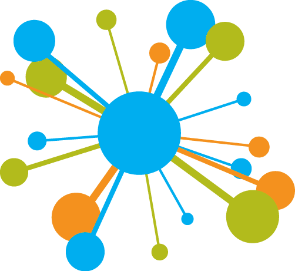
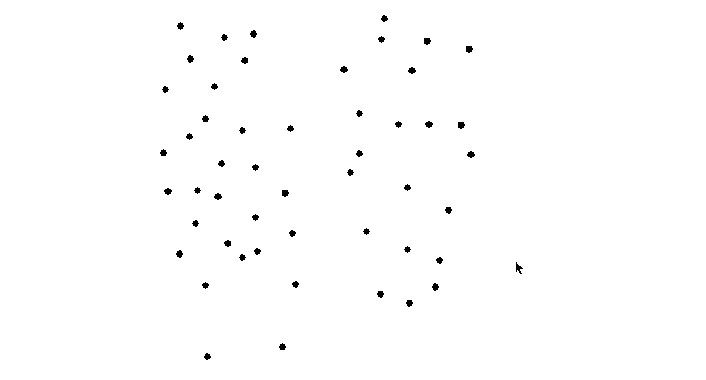

  

<h1 align="center">K-Means Clustering Simulator</h1>

	

<h4 align="center">Simulator for K Means Clustering Algorithm</h4>

<h2> How to use</h2>
<ol>
	<li>
		<h4>Plotting</h4>
		

			
		

		

			Plot the data points by clicking on the screen
		

	</li>
	
<li>
	<h4>Simulation</h4>
	

		
	

	

		Once the data points are plotted, press 'ENTER' key to simulate the first step of the algorithm. The data points will be divide into 2 clusters red and blue, here K=2.
		As we keep on the pressing the 'ENTER' key, we keep on moving towards proper formation of the clusters. The blue and red points are the data points and the bigger blue and red circles are their centroids.
	

</li>
	
	

</ol>
